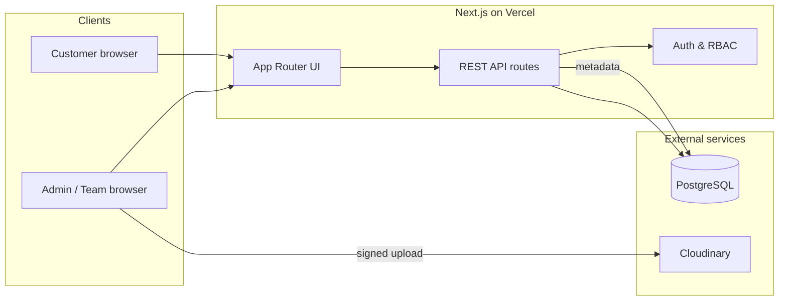

# Trizen Gallery

Full-stack photo sharing platform for event and photography teams. Admins orchestrate events and curated client galleries; team members upload on assignment; customers access published galleries via a shareable link and PIN—no account required.

**Live application:** [photobooth-kappa-inky.vercel.app](https://photobooth-kappa-inky.vercel.app)

---

## Demo access

| Role | Email | Password |
|------|--------|----------|
| Admin | `admin@trizen.demo` | `Admin123!` |
| Team member | `member@trizen.demo` | `Member123!` |

**Customer gallery (published demo event)**

| | |
|--|--|
| URL | [Open gallery](https://photobooth-kappa-inky.vercel.app/gallery/WSVoIv6reAY2) |
| PIN | `482917` |

Reviewers can follow the end-to-end flow: admin login → events and photo selection → gallery publish; team member login → upload to assigned event; incognito window → gallery URL + PIN.

---

## Capabilities

- Admin registration, authentication, and session management
- Event lifecycle: create event, assign existing team members by email, review all uploads
- Photo curation: select/unselect images for client delivery
- Gallery publishing: unique slug, bcrypt-hashed 6-digit PIN, shareable URL
- Team uploads: signed direct-to-Cloudinary uploads with metadata persisted in PostgreSQL
- Customer experience: PIN gate, scoped gallery session, responsive grid and lightbox
- Role-based access control enforced on every protected API route

### Roles

| Role | Capabilities |
|------|----------------|
| **Admin** | Events, assignments, full photo review, gallery PIN, publish |
| **Team member** | Assigned events only; upload and view own photos |
| **Customer** | Link + PIN; view published gallery only |

---

## Technology stack

| Layer | Choice |
|-------|--------|
| Application | Next.js 16 (App Router), React, TypeScript, Tailwind CSS |
| API & validation | Route handlers, Zod |
| Database | PostgreSQL, Prisma ORM |
| Authentication | bcrypt passwords, JWT in HTTP-only cookies (jose) |
| Media | Cloudinary (images not stored in the database) |
| Hosting | Vercel, Neon (PostgreSQL) |
| Tests | Vitest (integration tests against PostgreSQL) |

---

## System architecture



**Auth flow:** Staff sessions use a signed `trizen_session` cookie (HttpOnly, Secure in production).

**Upload flow:** Team member requests signed upload parameters → browser uploads to Cloudinary → API stores photo metadata linked to event and uploader.

**Gallery flow:** Customer submits PIN → server verifies bcrypt hash → short-lived gallery-scoped cookie → photo list served only for published `GalleryPhoto` records.

---

## Data model

| Entity | Description |
|--------|-------------|
| `User` | Accounts with `ADMIN` or `TEAM_MEMBER` role |
| `Event` | Owned by an admin; hub for members, photos, and gallery |
| `EventMember` | Many-to-many assignment of team members to events |
| `Photo` | File metadata (URL, size, mime, uploader, selection flag); binary assets on Cloudinary |
| `Gallery` | One per event; public `slug`, hashed PIN, publish state |
| `GalleryPhoto` | Snapshot of selected photos exposed to customers after publish |

Passwords and gallery PINs are never stored in plain text.

---

## Repository layout

```
src/app/          Pages and API routes (App Router)
src/components/   UI and layout
src/lib/          Auth, authorization, Cloudinary, validation
src/server/       Domain services
prisma/           Schema and seed data
tests/            Vitest integration tests
```

---

## Running locally

**Prerequisites:** Node.js 20+, PostgreSQL, Cloudinary account.

1. `npm install`
2. Copy `.env.example` to `.env` and set `DATABASE_URL`, `AUTH_SECRET`, and Cloudinary credentials (see `.env.example` for the full list).
3. Apply schema and seed demo data:

   ```bash
   npm run db:push
   npm run db:seed
   ```

4. `npm run dev` → [http://localhost:3000](http://localhost:3000)

Docker Compose is included for a local PostgreSQL instance if preferred.

---

## Testing

```bash
npm test
```

Integration tests cover authentication, authorization boundaries, photo access rules, gallery publishing, PIN verification, and cross-gallery session isolation. Use a dedicated database for tests (see `tests/helpers/db.ts`); do not point tests at a production database.

---

## Security highlights

- Server-side RBAC and resource ownership checks (events, photos, galleries)
- Separate customer gallery session, isolated per slug
- Unpublished galleries are not exposed publicly; invalid PIN does not leak photo URLs
- PIN attempt rate limiting (in-memory; suitable for demo scale)
- Input validation on API boundaries

---

## Design notes

Team members must already exist in the system before assignment by email (demo accounts are provided via seed). This keeps the submission focused on core workflow—events, uploads, curation, and PIN-protected delivery—while leaving invite-based onboarding as a natural extension.

---

## License

Submitted as part of the TrizenAI engineering assessment. All secrets belong in environment configuration only; none are committed to this repository.
